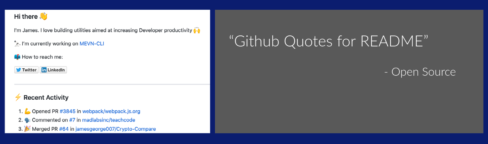

<p align="center">
  
  <h2 align="center">Github Readme Quotes: Dynamic quote generator for your GitHub readmes</h2>
</p>



   [](https://github.com/shravan20/github-readme-quotes/graphs/contributors)    [](https://github.com/shravan20/github-readme-quotes/)
<a href="https://discord.gg/2nN2VqwNaK">

</a>

<br><br>

## Current status

- [x] Project Status: Migrated to Vercel Cloud

- [x] Project Deployment Status: I have moved it from Heroku to Vercel Cloud now. Please access the content from UI on **[https://github-readme-quotes-returns.vercel.app](https://github-readme-quotes-returns.vercel.app)** and utility on **[https://github-readme-quotes-bay.vercel.app/quote](https://github-readme-quotes-bay.vercel.app/quote)**

- [x] Self-Hosting and Contributions: If you wish to host the project on your own,
      you can fork the repository and deploy it according to your needs. Feel free to reach
      out to me if you require any assistance or have inquiries about the project.
      Your contributions and involvement in the project are welcome.

---

<div>
    
    <p align="center">Big shoutout to Vercel for their amazing hosting service! <a href="https://github.com/vercel"> @vercel </a></p>
</div>

<p align="center">
  <h1 align="center">
    Featuring on <a href="https://www.producthunt.com/posts/dynamic-github-profile-readme-quotes?utm_source=badge-featured&utm_medium=badge&utm_souce=badge-dynamic-github-profile-readme-quotes" target="_blank"></a>
  </h1>
</p>

<p align="center">
  <a href='https://ko-fi.com/V7V1PFDPE' target='_blank'></a>
</p>

<p align="center">
 <b><i> Inspired by <a href="https://github.com/anuraghazra"> @anuraghazra </a> </i></b>
</p>

---

<br>

### Use [User Interface](https://github-readme-quotes-bay.vercel.app/), to view designed quotes and copy link and paste it directly


---

## Features

| Sl No |                    Feature Name                    |                                   Description                                    |
| :---: | :------------------------------------------------: | :------------------------------------------------------------------------------: |
|   1   |     [Dynamic Quotes](#github-readme-quotes-1)      |        Different quotes every time its rendered for GitHub Profile Readme        |
|   2   |             [Colorful Themes](#themes)             |                   Various colorful themes available for cards                    |
|   3   |             [Design Layouts](#layouts)             |                   Different Layout design cards are available                    |
|   4   |              [Animation](#animations)              |                       Animations available for quote cards                       |
|   5   | [Custom Quotes from GitHub Gists](#custom-quotes)  | You can add custom quotes of your own or own choice from GitHub Gists json files |
|   6   | [Quotes based on Category](#category-based-quotes) |                  Different category based quotes are available                   |

---

<p align="center">
Note: To read an article on this project, please refer:
<a href = "https://dev.to/imshravan/github-profile-readme-animated-dynamic-quote-generator-4le6"><i>GitHub Profile README : Animated Dynamic Quote Generator</i></a>
</p>

---

# Github Readme Quotes

Copy and paste the following markdown content to display the quote.

```md

```

<!-- Scrnshot of quote in default mode -->
<p align="center">
  
</p>

<br><hr>

- ### Themes

You can display your quote in different themes without any manual customization.

Use `?theme=THEME_NAME` parameter as shown below.

```md

```

<!-- Scrnshot of quote in dark theme -->

#### Available Themes

dark, radical, merko, gruvbox, tokyonight, onedark, cobalt, synthwave, highcontrast, dracula

**Dark**


**Light Theme**


<!-- Scrnshot of quote in different themes -->

You can explore different themes [here](./src/themes/README.md).

<b>Feel free to contribute different themes.</b>

---

- ### Layouts

You can also change the layout of your templates.

Use `?layout=LAYOUT` parameter as shown below

```md

```

#### Layout 1 (Default)


#### Layout 2 (Socrates)


<!-- Scrnshot of quote in particular layout -->

You can explore different layouts [here](./src/layouts/README.md).

<b>Feel free to contribute different layouts.</b>

---

- ### Fonts

You can also add fonts to your templates.

Use `?font=FONT_NAME` parameter as shown below

```md

```

#### Font 1 (Default)


#### Font 2 (Redressed)


<!-- Scrnshot of quote in different fonts -->

You can explore different fonts [here](./src/fonts/README.md).

<b>Feel free to contribute different fonts.</b>

---

- ### Animations

You can also add animations to your templates.

Use `?animation=ANIMATION` paramater as shown below

```md

```

<!-- Gif of quote in animation -->

#### Animation 1


You can explore different animations [here](./src/animations/README.md).

---

- ### Custom Quotes

You can also provide a file with the list of quotes and a random quote will be generated for you.

#### Follow the steps to provide your own custom quotes

- Use the template provided at [here](./customQuotes/quotes.json) and write your own file with multiple quotes.
- Save the file in the repository in any (public) directory or anywhere in the internet.
- Get the link of the file.
- Use `?quotesUrl=URL` as shown below

  ```


  
  ```


---

- ### Category based Quotes

You can also provide a category to fetch the list of quotes based on certain category and a random quote will be generated for you based on category you specify.

#### Available Categories

|         |             |          |              |
| ------- | ----------- | -------- | ------------ |
| general | life        | success  | motivational |
| fun     | programming | dream    | failure      |
| gaming  | birthday    | Humorous | Travel       |

- Use `quoteCategory=categoryName` as shown below

  ```


   
  ```


<b>Feel free to contribute different quotes to different categories.</b>

#### Follow the steps to add quotes to category

- Add the quote you want in this [file](./customQuotes/category.json) based on the category it falls into.
- If the category you want doesn't exist, feel free to add the category in this [file](./customQuotes/category.json) and add the quotes.

---

- ### Border Color

You can customize the border color of your templates. Please note that this feature is available only with the Default layout.

Use `?borderColor=COLOR` paramater as shown below

```md

```


---

- ### Unsplash Background
  You can fetch random background images from [Unsplash](https://unsplash.com/) by specifying two parameters:

1. `bgSource=unsplash`
2. `unsplashQuery=ANY_KEYWORD` (optional)

```md

```


---

## Swagger Docs

To view Swagger docs, run `npm start` and open .

---

<div>
    <h5> <em>Huge Shoutout to all the Star-Gazers</em></h5>
    <a href="https://github.com/shravan20/github-readme-quotes/stargazers">
        
    </a>
</div>

<hr>

<div>
    <h5> <em>Huge Shoutout to all the Forkers</em></h5>
    <a href="https://github.com/shravan20/github-readme-quotes/network/members">
        
    </a>
</div>
<hr>

## Running the Project with Docker

<strong>Prerequisites</strong>
<a href="https://www.docker.com/get-started" target="_blank">Install Docker</a>

<strong>Run in Development</strong>

```md
docker-compose --env-file .env.development up --build
```

<strong>Run in Production</strong>

```md
docker-compose -f docker-compose.prod.yml up -d --build
```

<hr>
